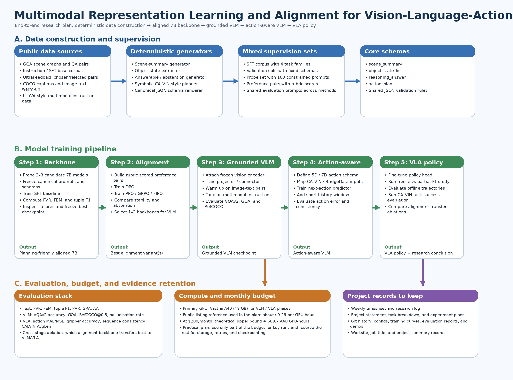

# Multimodal Representation Learning and Alignment for Vision-Language-Action Systems

This repository tracks an end-to-end research project that studies how **alignment choices for a 7B language backbone** affect downstream transfer to **grounded VLMs** and **vision-language-action (VLA) policies**.



## Project Objective

The core research question is:

> Which alignment method produces a 7B language backbone that transfers best to grounded vision-language modeling and language-conditioned action prediction?

The project is organized as a staged pipeline:

1. Build a planning-friendly aligned 7B language backbone.
2. Compare SFT, DPO, PPO, GRPO, and FIPO as alignment methods.
3. Attach a vision encoder and train a grounded VLM.
4. Extend the VLM into an action-aware model.
5. Fine-tune a VLA policy and compare transfer across alignment backbones.

## System Overview

### A. Data construction and supervision
The text-side supervision is built from a mix of public data and deterministic generators:

- **GQA scene graphs + QA pairs** for scene summaries, object-state extraction, and answerable reasoning.
- **GQA-derived abstention samples** generated by removing the minimum fact needed to answer a valid question.
- **Synthetic CALVIN-style symbolic planning data** generated from object states, instructions, and a rule-based planner.
- **Instruction-following base data** for schema-constrained text generation.
- **Preference data** built from public chosen/rejected sources plus rubric-scored project-specific pairs.

### B. Shared Schemas
All model variants use the same canonical JSON schemas:

- `scene_summary`
- `object_state_list`
- `reasoning_answer`
- `action_plan`

### C. Training Stages

#### Step 1 — Backbone selection + SFT baseline
- Probe 2–3 candidate 7B models with a fixed constrained-format prompt set.
- Freeze prompt templates and output schemas.
- Train the first SFT checkpoint using the mixed corpus.

#### Step 2 — Preference and RL-style alignment
- Build rubric-scored chosen/rejected pairs.
- Train DPO.
- Train PPO, GRPO, and FIPO.
- Compare stability, formatting control, groundedness, abstention behavior, and planning quality.

#### Step 3 — Grounded VLM
- Attach a frozen vision encoder.
- Train a connector/projector.
- Warm up on image-text data.
- Tune on multimodal instruction data.

#### Step 4 — Action-aware VLM
- Define a shared action representation.
- Map language + observation pairs to next-action supervision.
- Add short temporal context and evaluate consistency.

#### Step 5 — VLA policy
- Fine-tune the best action-aware model into a VLA policy.
- Evaluate offline trajectories and CALVIN task-level success.
- Run cross-stage transfer ablations across alignment backbones.

## Data Construction Details

### 1. Scene summary samples
**Source:** GQA scene graphs  
**Method:** Parse objects, attributes, and relations, then deterministically render a canonical summary.

Example target:
```json
{
  "scene_summary": "A red block is on the table in front of an open drawer.",
  "salient_objects": ["red block", "drawer"],
  "relevant_state": ["drawer=open", "gripper=empty"]
}
```

### 2. Object-state extraction samples
**Source:** GQA scene graphs  
**Method:** Convert objects and relations into a canonical object-centric state list.

### 3. Reasoning and abstention samples
**Source:** GQA QA pairs + derived variants  
**Method:** Keep answerable cases as reasoning supervision. Create abstention cases by removing the minimum supporting fact, making the correct target `"insufficient information"`.

### 4. Action-plan samples
**Source:** Synthetic symbolic environment with CALVIN-style task vocabulary  
**Method:** Sample a legal scene state, sample an instruction, and run a rule-based planner to produce:
- feasibility
- preconditions
- short action plan
- goal state

## Model Outputs

### Text Backbone
The aligned backbone is trained to emit:
- concise scene summaries
- structured object-state lists
- grounded reasoning answers
- abstention when information is insufficient
- short task-level action plans

### VLM
The grounded VLM should support:
- image-conditioned question answering
- scene understanding
- grounded instruction following
- task-relevant state summarization

### Action-aware VLM / VLA
The action-aware model and VLA policy should support:
- next-action prediction
- short-horizon action consistency
- language-conditioned manipulation
- task-level success on held-out sequences

## Evaluation

### Text-stage Metrics
- **FVR**: Format Validity Rate
- **FEM**: Field Exact Match
- **Tuple F1**: groundedness over extracted tuples
- **PVR**: Plan Validity Rate
- **GRA**: Goal-Reach Accuracy
- **AA**: Abstention Accuracy

### VLM-stage Metrics
- VQAv2 accuracy
- GQA accuracy / consistency
- RefCOCO(g) grounding accuracy at IoU >= 0.5
- hallucination rate

### VLA-stage Metrics
- action MAE / MSE
- gripper accuracy
- sequence consistency
- CALVIN average sequence length / task success

## Action Representation

The working low-level action format is:

```text
[Δx, Δy, Δz, Δroll, Δpitch, Δyaw, gripper]
```

A simplified 5D version can be used early in development:

```text
[Δx, Δy, Δz, Δyaw, gripper]
```

Example task:
> Pick up the red block and place it inside the open drawer.

The model should map observation + instruction into a sequence of end-effector deltas and gripper commands.

## Suggested Compute Plan

Primary GPU target:
- **Vast.ai A40 (48 GB)** for VLM and VLA stages
- smaller text-only debugging can optionally run on cheaper 24 GB cards, but the main plan assumes A40

Budget framing used in the project plan:
- public A40 reference price used in the plan: about **$0.29 / GPU-hour**
- at **$200 / month**, the theoretical upper bound is about **689.7 GPU-hours**
- practical planning should reserve part of the budget for storage, interrupted runs, retries, and checkpoint retention

## Suggested Repository Structure

```text
.
├── README.md
├── system_architecture.svg
├── docs/
│   ├── project_statement.md
│   ├── metrics.md
│   ├── sevp_reporting_notes.md
│   └── weekly_logs/
├── data_gen/
│   ├── build_scene_summary.py
│   ├── build_object_state.py
│   ├── build_abstention.py
│   └── build_symbolic_plans.py
├── configs/
├── scripts/
├── src/
│   ├── text_alignment/
│   ├── vlm/
│   ├── action_model/
│   └── vla/
├── outputs/
│   ├── checkpoints/
│   ├── reports/
│   └── figures/
└── evidence/
    ├── timesheets/
    ├── weekly_logs/
    ├── expense_receipts/
    └── sevp_records/
```

## Evidence Retention

Keep these artifacts continuously:

- weekly timesheet
- weekly research log
- project statement
- experiment plans
- git history and tagged checkpoints
- training and evaluation reports
- demos / slides / screenshots
- expense receipts for compute or tooling